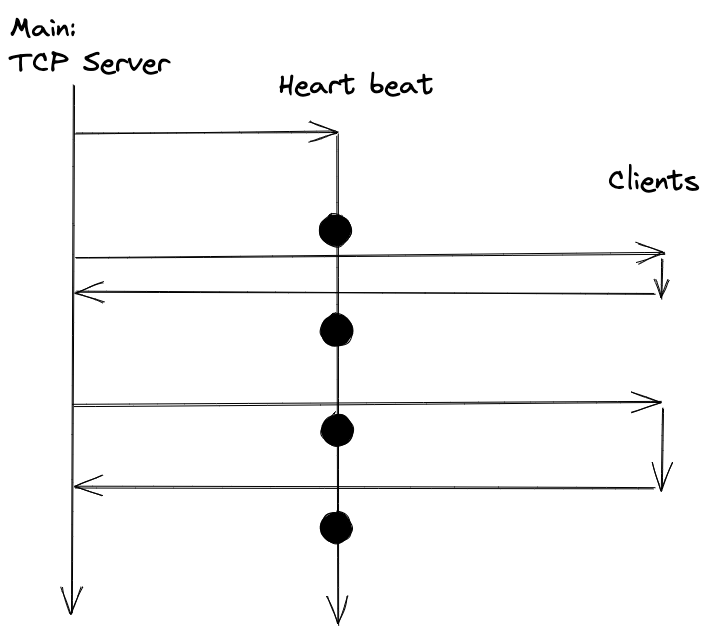

# gom: job monitor

## design

The CUI

- `gom config`
- `gom quit`
- `gom run`: submit python script
- `gom start`: start the server, or reset stats if server is already up
- `gom show [-v] [-t type]`

- Here `start` spins up the server if it's not up, or resets the stats for a
  running server
- `-t` picks running fail success
- `config` shows the current settings, including
  - refresh interval
  - cmd.status
  - cmd.fail
  - port

The config file is assumed to be at home dir.

## TODO

- [x] report in csv format
- [x] only record the failed jobs
- [x] define .yaml file for server config
- [x] subprocess call to the commands
- [ ] swap monitoring command (say user name)
- [x] parse status command and populate data store

## Maybe
- [ ] individual sessions, maybe with secret key for each session
- [ ] client write to the server
